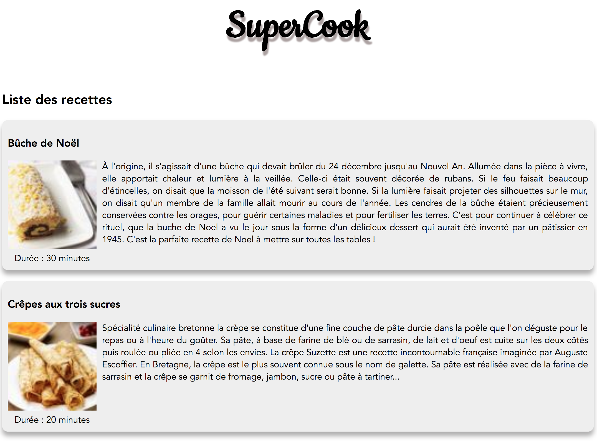

# Hands-On Vue.js

> [Accès à la présentation](https://raw.githubusercontent.com/xebia-france/devoxx2018-vuejs/master/presentation-vuejs.pdf)

- Ludovic Ladeu
- Thomas Champion [@ReeskaFr](https://twitter.com/ReeskaFr)

## Installation

### Prérequis

Attention, pour fonctionner Vue.js requiert au moins **node v6**.

``` bash
# install dependencies
npm install

# serve with hot reload at localhost:8080
npm run serve
```

Plus d'informations sur la très complète [documentation officielle](https://vuejs.org/v2/guide/).

## Synopsis

L'objectif de ce Hand's On est de mettre en pratique vos connaissances sur Vue.js en développant une application de partage de recettes.

Cet exercice est découpé en 5 étapes afin d'introduire au fur et à mesure les concepts de Vue.js, et ainsi de construire l'application qui détrônera Marmiton.

## Etape 2

Maintenant que nous avons un composant `Recipe`, il va nous falloir récupérer la vraie liste des recettes que nous avons en stock et la présenter aux clients.

Pour ce faire nous avons mis à disposition une méthode `getRecipes` dans le service `recipes-services`.

Créer le composant `Recipes` : 

* Importer le service `recipes-service`
* Importer le composant `Recipe`
* Ajouter une propriété recipes initialisée avec un tableau vide
* Servez-vous du *hook* approprié pour récupérer l'ensemble des recettes (en appelant la méthode getRecipes)
* Utiliser `v-for` pour afficher la liste des recettes

#### Résultat attendu



A vous de jouer !

Si vous avez terminé, ou pour les plus impatients, vous trouverez la suite et solution sur la [branche step-3](https://github.com/xebia-france/devoxx2018-vuejs/tree/step-3).
