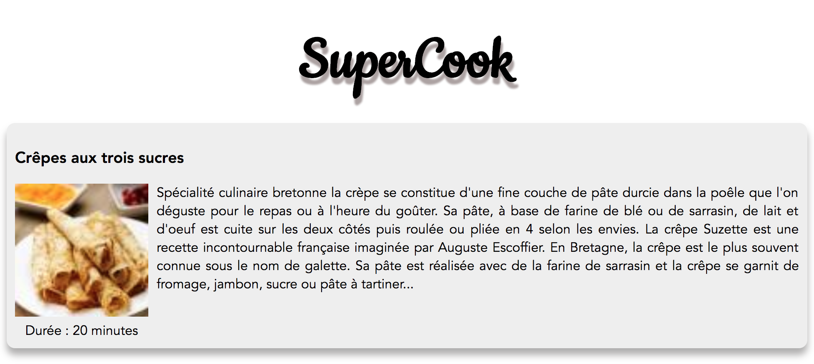

# Hands-On Vue.js

> [Accès à la présentation]()

- Ludovic Ladeu
- Thomas Champion [@ReeskaFr](https://twitter.com/ReeskaFr)

## Installation

### Prérequis

Attention, pour fonctionner Vue.js requière au moins **node v5**.

``` bash
# install dependencies
npm install

# serve with hot reload at localhost:8080
npm run dev
```

Plus d'informations sur la très complète [documentation officielle](https://vuejs.org/v2/guide/).

## Synopsis

L'objectif de ce Hand's On est de mettre en pratique vos connaissances sur Vue.js en développant une application de partage de recettes.

Cet exercice est découpé en 5 étapes afin d'introduire au fur et à mesure les concepts de Vue.js, et ainsi de construire l'application qui détrônera Marmiton.

## Etape 1

Cette première étape consiste à se familiariser avec la création de composants.
Pour ce faire, vous devez créer un composant `Recipe` qui aura la lourde tâche d'afficher les informations d'une recette.

Cette branche met à disposition un service `recipes-service` qui contient une unique opération `getRecipe` qui permet de récupérer les données suivantes :

```json
{
    "uid": "DFG024543TGJVZ2139RGKG",
    "nom": "Crêpes aux trois sucres",
    "type": "Végétarien",
    "cuisson": 20,
    "ingredients": [
      {"label": "250 g de farine"},
      {"label": "4 œufs"},
      {"label": "50 cl de lait"},
      {"label": "50 g de beurre fondu"},
      {"label": "85 g de sucre en poudre"},
      {"label": "10 cl de sirop de sucre de canne"},
      {"label": "5 sachets de sucre vanillé"},
      {"label": "(Bourbon de préférence) 15 cl de Cognac"},
      {"label": "1 pincée de sel"},
      {"label": "250 g de farine"}
    ],
    "histoire": "S'écialité culinaire bretonne la crèpe se constitue d'une fine couche de pâte durcie dans la poêle que l'on déguste pour le repas ou à l'heure du goûter. Sa pâte, à base de farine de blé ou de sarrasin, de lait et d'oeuf est cuite sur les deux côtés puis roulée ou pliée en 4 selon les envies. La crêpe Suzette est une recette incontournable française imaginée par Auguste Escoffier. En Bretagne, la crêpe est le plus souvent connue sous le nom de galette. Sa pâte est réalisée avec de la farine de sarrasin et la crêpe se garnit de fromage, jambon, sucre ou pâte à tartiner...",
    "img_small": "https://images.marmitoncdn.org/recipephotos/multiphoto/83/83f69e59-8663-4d27-bb84-63d8a43066ab_tn-80x80.jpg",
    "img_big": "https://image.afcdn.com/recipe/20170404/49483_w420h344c1cx3024cy2016.jpg"
}
```

### Instructions

#### 1. Création du composant Recipe

Dans le répertoire *components* il existe un fichier Recipe.vue qui contient déjà la partie style, ainsi que les parties templates et script à compléter.

Il suffit alors de suivre les instructions en TODOs.

Dans un premier temps dans la partie *script* définir le composant. 

Pour vous aider voici une exemple de composant :

```html
<script>
   export default {
       props: ['title'],
       data() {
           return {
               date: new Date().toString()
           };
       },
   };
</script>
```

#### 2. Utilisation du composant Recipe

Dans le composant App :

* Déclarer le composant Recipe que vous allez utilisé, pour ce faire dans la partie **script** : 
  * importer le composant Book : `import Recipe from './components/Recipe';`
  * ajouter au composant App : `components: { Recipe }`
* Pour récupérer les informations de la recette, importer le service `recipes-service` : `import RecipesService from './services/recipes-service';`
* Faire appel à la méthode getRecipe pour récupérer les informations d'une recette à assigner à la propriété `recipe` du composant `App` :
```javascript
  data () {
    return {
      recipe: RecipeService.getRecipe()
    };
  }
```
* Utiliser le composant `Recipe` dans la partie **template** en suivant les TODOs.

#### Résultat attendu



A vous de jouer !

Si vous avez terminé, ou pour les plus impatients, vous trouverez la suite et solution sur la [branche step-2](https://github.com/xebia-france/xebicon17-vuejs/tree/step-2).
